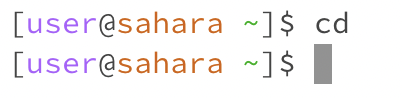
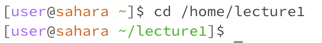
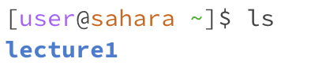

# Lab Report 1 # 

### 1. cd command no arguments ###

* When I type in `cd`, nothing changes because I am already in the home directory
* The `cd` command with no arguments is used to switch the current working directory to the home directory 
* However, if I were in a different directory, if I used the `cd` command, I would be taken back to the home directory
* This is not an error

### 2. cd command with a path to a directory ###

* The current directory I am working on in this example is the home directory 
* Typing in `cd` with the path to the `lecture1` directory would change my current directory to `lecture1`
* This is not an error

### 3. cd command with a path to a file ###

* In this example, I am already in the `lecture1` directory
* Entering `cd` with the path to the `en-us.txt` file gives me an error
* This is because the `cd` command allows me to change directories, and I can’t change directories from inside of a file 

### 4. ls command no arguments ###

* Since I am working in the home directory in this example, typing in `ls` prints all the contents of the home directory, which is `lecture1`
* The `ls` command is used to list the files and folders of a given path
* If I was in the `lecture1` directory then it would print out all of the contents of the lecture1 directory
* This is not an error

### 5. ls command with a path to a directory ###

* I am working in the home directory in this example
* Using `ls` with a path to the `lecture1` directory would print all the files and contents in the `lecture1` folder
* This is not an error
  
### 6. ls command with a path to a file ###

* I am working in the home directory in this example
* Typing in `ls` with the absolute path to a text file in the `messages` directory would print back the path of the file
* This is because `ls` is only meant to print the contents of a directory, so when I pass in the path to a file, it just prints the path of the file and not the contents
* This is not an error

### 7. cat command no arguments ###

* I am working in the home directory in this example
* The `cat` command is used to print the contents of one or more files given by a path
* Since I am providing no paths, `cat` would print out the user input that we provide in the terminal back to us until we cancel out the command with control C
* This is not an error

### 8. cat command with a path to a directory ###

* I am working in the home directory in this example
* Using the `cat` command with a path to the `lecture1` directory would print out an error that the command is a directory
* This is an error because we know the `cat` command only prints out file contents and can't print out a directory 

### 9. cat command with a path to a file ###

* I am working in the home directory in this example
* Entering the `cat` command with an absolute path to the file `oui-fr.txt` would print out the file's contents - "Bonjour le monde!"
* This is not an error
