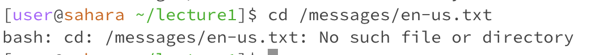

# Lab Report 1 # 

### 1. cd command no arguments ###

* The cd command is used to switch the current working directory to the given path
* Since we are providing no path or arguments in this example, when we type in cd, nothing happens because we are not changing current directory

### 2. cd command with a path to a directory ###

* Typing in cd with the path to the lecture1 directory changes our current directory to that of lecture1

### 3. cd command with a path to a file ###

* Entering cd with the path to the en-us.txt file gives us an error
* This is because the cd command allows us to change directories, and we can’t change directories from a file

### 4. ls command no arguments ###

* The ls command is used to list the files and folders of a given path
* Since we are in the home directory, typing in ls prints all the contents of the home directory

### 5. ls command with a path to a directory ###

* Using ls with a path to the lecture1 directory would print all the files and contents in the lecture1 folder
  
### 6. ls command with a path to a file ###

* Typing in ls with the path to a file in the messages directory would just print the path of the file
* This is kind of an error, because ls is only meant to print the contents of a folder, so when we pass in a file, it just prints the path of the file and not any of the contents

### 7. cat command no arguments ###

* The cat is used to print the contents of one or more files given by the path
* Since we are providing no paths, cat just prints out the user input that we provide in the terminal back to us until we cancel out the command 

### 8. cat command with a path to a directory ###

* Using the cat command with an path to the lecture1 directory would print out an error that the command is a directory
* This is an error because we know the cat command only prints out file contents and can't print out a directory 

### 9. cat command with a path to a file ###

* Entering the cat command with an path to the file oui-fr.txt would print out the contents of the file - "Bonjour le monde!"
