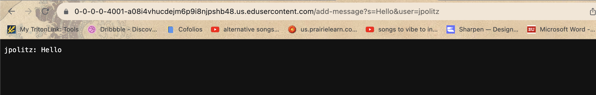
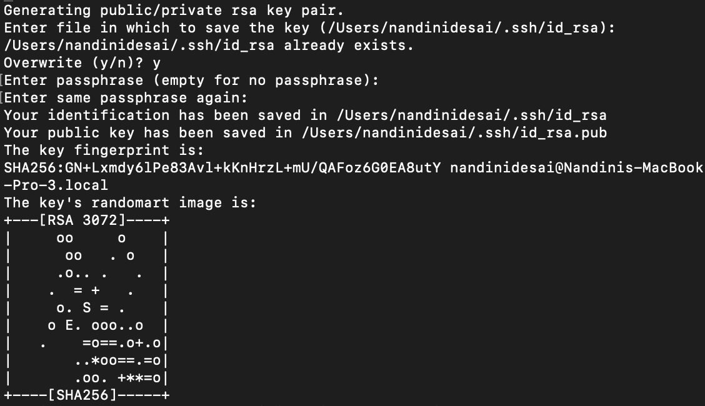
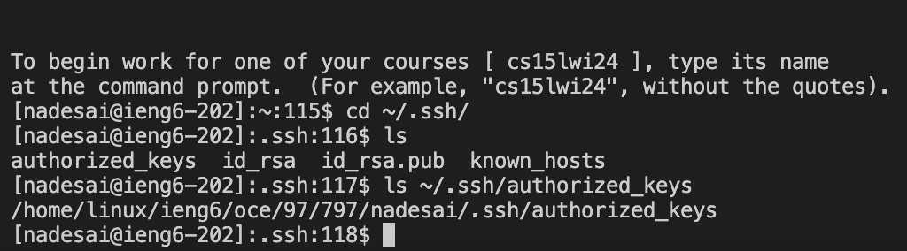

# Lab Report 2 # 

### ChatServer.java Code ###
```
import java.io.IOException;
import java.net.URI;
import java.util.ArrayList;

class Handler implements URLHandler {
    ArrayList<String> messages = new ArrayList<>();

    public String handleRequest(URI url) {
        if (url.getPath().equals("/")) {
            return "Please enter a message";
        } else if(url.getPath().equals("/add-message")) {
            String[] parameters = url.getQuery().split("&");
            String user = null; 
            String message = null; 

            for(String parameter: parameters) {
                String[] key = parameter.split("=");
                if(key.length == 2) {
                    if(key[0].equals("user")) {
                        user = key[1];
                    } else if(key[0].equals("s")) {
                        message = key[1];
                    }
                }
            }

            if (user != null && message != null) {
                messages.add(String.format("%s: %s", user, message));
                StringBuilder result = new StringBuilder();
                for (String m : messages) {
                    result.append(m).append("\n");
                }
                return result.toString();
            } else {
                return "Invalid parameters!";
            }
        } else {
            return "404 Not Found!";
        }
    }
}

class ChatServer {
    public static void main(String[] args) throws IOException {
        if(args.length == 0){
            System.out.println("Missing port number! Try any number between 1024 to 49151");
            return;
        }

        int port = Integer.parseInt(args[0]);

        Server.start(port, new Handler());
    }
}
```

## Part 1 ##


When I add a message, the `handleRequest` method is invoked. The argument passed to the `handleRequest` method is `/add-message?s=Hello&user=jpolitz`. Within the implementation, I instantiated an ArrayList field named `messages` to collate inputs. Before the initial message, the `messages` ArrayList is initialized as an empty container. Subsequently, upon processing the command line argument, the message is parsed, split, and formatted into the structure "user: message." This formatted chat message, in the form of "jpolitz: Hello," is then appended to the `messages` ArrayList. Thus, the `messages` ArrayList now stores the concatenated message.


When I add a second message, the `handleRequest` method is again invoked.  The argument supplied to the `handleRequest` method is `/add-message?s=How%20are%20you&user=yash`. The ArrayList `messages` contains the “jpolitz: Hello” entry from the preceding message. After this subsequent command line argument is added, the new message is parsed, split, and formatted into the structure "user: message." This newly formatted chat message, in the form of "yash: How are you," is then appended to the existing content within ArrayList `messages`. Consequently, the `messages` ArrayList now store both "jpolitz: Hello" and "yash: How are you."

## Part 2 ##

### 1. The absolute path to the private key for your SSH key for logging into `ieng6` ###


When configuring SSH access to my private key, I initiated a login session to the secure server `ieng6`. I utilized the command `cd ~/.ssh/` to navigate to the `.ssh` directory, ensuring that my working directory was appropriately set. A verification step using `pwd` confirmed my location within the correct directory. To ascertain the correct path to my private key, I executed `ls` with the absolute path, confirming the path's accuracy and the existence of the private key.

### 2. The absolute path to the public key for your SSH key for logging into `ieng6` ###


In a similar process for SSH key configuration, I commenced by logging into the secure server `ieng6` and subsequently navigating to the `.ssh` directory using `cd ~/.ssh/`. Confirming the working directory via `pwd` preceded the use of `ls` with the absolute path to my public key. This step validated the path's correctness and the public key's presence.

### 3. A terminal interaction where you log into your `ieng6` account without being asked for a password. ###


Following the execution of `ssh-keygen` and logging into my remote course-specific account on `ieng6` via ssh, I created the `.ssh` directory with `mkdir .ssh`. The subsequent action involved copying the public SSH key into the newly created `.ssh` directory, specifically in a file named `authorized_keys`. The `scp` command facilitated the transfer of the public key to the remote server. The final password entry was required during this process. The screenshot visually confirms the successful establishment of SSH key-based authentication, as subsequent SSH commands to `nadesai@ieng6.ucsd.edu` no longer prompt a password.

## Part 3 ##

In weeks 2 and 3 of lab, I learned about SCP, mkdir, ports, and SSH. Scp copies a file to a remote server. Mkdir means to make a directory. Ports are used to run servers. Sites on the public web use ports, too, but they hide it from you because it’s the default. SSH allows you to connect to the server. I also remember briefly talking about the curl command to access URLs, but I wasn’t entirely sure how to use it.
