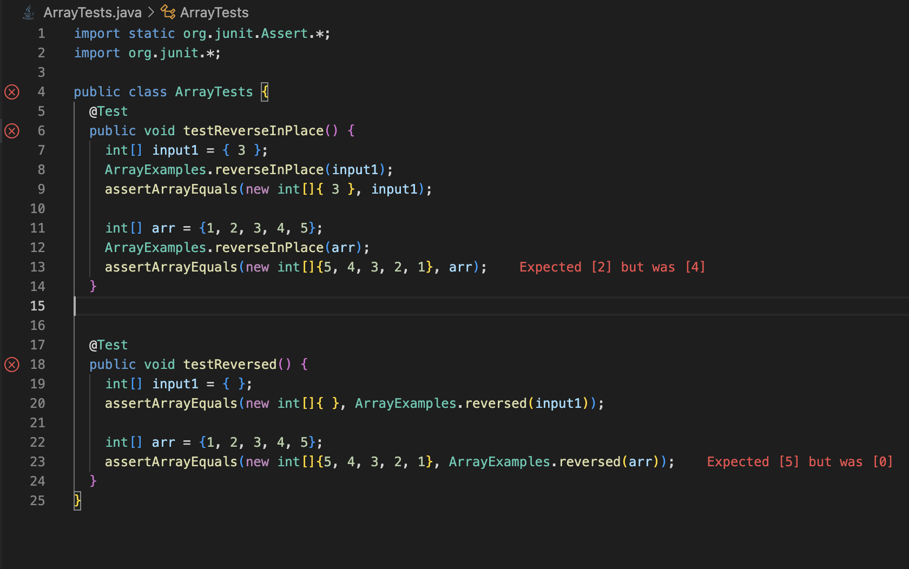

# Lab Report 3 # 

## Part 1 ##

### Failure-Inducing JUnit Tests ###
```
import static org.junit.Assert.*;
import org.junit.*;

public class ArrayTests {
  @Test 
  public void testReverseInPlace() {
    int[] arr = {1, 2, 3, 4, 5};
    ArrayExamples.reverseInPlace(arr);
    assertArrayEquals(new int[]{5, 4, 3, 2, 1}, arr);
  }

  @Test
  public void testReversed() {
    int[] arr = {1, 2, 3, 4, 5};
    assertArrayEquals(new int[]{5, 4, 3, 2, 1}, ArrayExamples.reversed(arr));
  }
}
```

### Non-Failure-Inducing JUnit Tests ###
```
import static org.junit.Assert.*;
import org.junit.*;

public class ArrayTests {
  @Test 
  public void testReverseInPlace() {
    int[] input1 = { 3 };
    ArrayExamples.reverseInPlace(input1);
    assertArrayEquals(new int[]{ 3 }, input1);
  }

  @Test
  public void testReversed() {
    int[] input1 = { };
    assertArrayEquals(new int[]{ }, ArrayExamples.reversed(input1));
  }
}
```

### Symptom of ArrayExamples.java ###


### Buggy ArrayExamples.java Code ###
```
public class ArrayExamples {

  // Changes the input array to be in reversed order
  static void reverseInPlace(int[] arr) {
    for(int i = 0; i < arr.length; i += 1) {
      arr[i] = arr[arr.length - i - 1];
    }
  }

  // Returns a *new* array with all the elements of the input array in reversed
  // order
  static int[] reversed(int[] arr) {
    int[] newArray = new int[arr.length];
    for(int i = 0; i < arr.length; i += 1) {
      arr[i] = newArray[arr.length - i - 1];
    }
    return arr;
  }

  // Averages the numbers in the array (takes the mean), but leaves out the
  // lowest number when calculating. Returns 0 if there are no elements or just
  // 1 element in the array
  static double averageWithoutLowest(double[] arr) {
    if(arr.length < 2) { return 0.0; }
    double lowest = arr[0];
    for(double num: arr) {
      if(num < lowest) { lowest = num; }
    }
    double sum = 0;
    for(double num: arr) {
      if(num != lowest) { sum += num; }
    }
    return sum / (arr.length - 1);
  }


}
```

### Debugged ArrayExamples.java Code ###
```
public class ArrayExamples {

  // Changes the input array to be in reversed order
  static void reverseInPlace(int[] arr) {
    int[] tempArray = new int[arr.length];

    for(int i = 0; i < arr.length; i++) {
      tempArray[i] = arr[arr.length - i - 1];
    }

    for(int i = 0; i < arr.length; i++) {
      arr[i] = tempArray[i];
    }
  }

  // Returns a *new* array with all the elements of the input array in reversed
  // order
  static int[] reversed(int[] arr) {
    int[] newArray = new int[arr.length];
    for(int i = 0; i < arr.length; i += 1) {
      newArray[arr.length - i - 1] = arr[i];
    }
    return newArray;
  }

  // Averages the numbers in the array (takes the mean), but leaves out the
  // lowest number when calculating. Returns 0 if there are no elements or just
  // 1 element in the array
  static double averageWithoutLowest(double[] arr) {
    if(arr.length < 2) { return 0.0; }
    double lowest = arr[0];
    for(double num: arr) {
      if(num < lowest) { lowest = num; }
    }
    double sum = 0;
    for(double num: arr) {
      if(num != lowest) { sum += num; }
    }
    return sum / (arr.length - 1);
  }

}
```
The original `reverseInPlace()` method mistakenly assigned the last element of the input array arr to the first element, causing
the loss of values for the initial elements due to overwriting. For instance, when arr[1] = 4, this statement overwrote it so that
when arr[4] was supposed to equal 1, arr[1] became 4, preventing the intended reversal. The revised code resolves this issue by 
storing the elements of the arr array in newArray, starting with the first element of arr and the last element of newArray. 
Subsequently, the elements of newArray are reassigned back to arr, ensuring the reversal is performed correctly.

In the original `reversed()` method, the input array arr was initially assigned to newArray in reverse order, but newArray remained 
empty, resulting in all elements of arr being set to 0. To address this bug, I reversed the assignment so that newArray now stores
the elements of the arr array in reverse order, resolving the issue of empty newArray and ensuring the correct reversal of elements.

## Part 2 ##

### grep command ### 
`grep` searches any given input files, selecting lines that match one or more patterns. By default, a pattern matches an input line if the regular expression in the pattern matches the input line without its trailing newline. An empty expression matches every line.  Each input line that matches at least one of the patterns is written to the standard output.

1. `grep -c`: prints only a count of the lines that match a pattern

```
Nandinis-MacBook-Pro-3:docsearch nandinidesai$ grep -c "pbio" grep-results.txt 
102
Nandinis-MacBook-Pro-3:docsearch nandinidesai$ grep -c "pmed" grep-results.txt 
150
```

1. `grep -n`: displays the matched lines and their line numbers.

```
Nandinis-MacBook-Pro-3:docsearch nandinidesai$ grep -n "pmed" plos-sizes.txt 
103:     345    3327   26050 technical/plos/pmed.0010008.txt
104:     152    1880   12639 technical/plos/pmed.0010010.txt
105:     148    1502   11072 technical/plos/pmed.0010013.txt
106:     167    1741   12576 technical/plos/pmed.0010021.txt
107:      82     871    6073 technical/plos/pmed.0010022.txt
108:      47     522    3619 technical/plos/pmed.0010023.txt
109:      47     489    3597 technical/plos/pmed.0010024.txt
110:      39     379    2843 technical/plos/pmed.0010025.txt
111:      85     883    6414 technical/plos/pmed.0010026.txt
112:     485    5254   39355 technical/plos/pmed.0010028.txt
113:      40     412    2963 technical/plos/pmed.0010029.txt
114:      46     413    3234 technical/plos/pmed.0010030.txt
115:     106    1110    8190 technical/plos/pmed.0010034.txt
116:     470    4814   35535 technical/plos/pmed.0010036.txt
117:     182    1976   14445 technical/plos/pmed.0010039.txt
118:     101    1036    7641 technical/plos/pmed.0010041.txt
119:     130    1431   10380 technical/plos/pmed.0010042.txt
120:     316    3049   24586 technical/plos/pmed.0010045.txt
121:      80     890    6385 technical/plos/pmed.0010046.txt
122:      54     579    4056 technical/plos/pmed.0010047.txt
123:      61     646    4529 technical/plos/pmed.0010048.txt
124:      53     534    4082 technical/plos/pmed.0010049.txt
125:      46     475    3467 technical/plos/pmed.0010050.txt
126:     112    1203    8321 technical/plos/pmed.0010051.txt
127:     195    2229   15953 technical/plos/pmed.0010052.txt
128:     198    2066   15680 technical/plos/pmed.0010056.txt
129:     195    2128   16284 technical/plos/pmed.0010058.txt
130:     150    1676   11952 technical/plos/pmed.0010060.txt
131:     101     983    7706 technical/plos/pmed.0010061.txt
132:     357    3709   28156 technical/plos/pmed.0010062.txt
133:     390    4108   30314 technical/plos/pmed.0010064.txt
134:     312    3123   24269 technical/plos/pmed.0010066.txt
135:      38     344    2534 technical/plos/pmed.0010067.txt
136:      39     389    2754 technical/plos/pmed.0010068.txt
137:      52     546    3963 technical/plos/pmed.0010069.txt
138:      53     549    4041 technical/plos/pmed.0010070.txt
139:      69     799    5496 technical/plos/pmed.0010071.txt
140:     143    1443   10869 technical/plos/pmed.0020002.txt
141:     123    1253    9559 technical/plos/pmed.0020005.txt
142:     144    1457   11122 technical/plos/pmed.0020007.txt
143:     207    2282   17310 technical/plos/pmed.0020009.txt
144:     294    3178   24126 technical/plos/pmed.0020015.txt
145:     333    3622   27076 technical/plos/pmed.0020016.txt
146:     209    1543   12116 technical/plos/pmed.0020017.txt
147:     490    4815   37686 technical/plos/pmed.0020018.txt
148:      46     442    3270 technical/plos/pmed.0020019.txt
149:      51     491    3761 technical/plos/pmed.0020020.txt
150:      40     383    2765 technical/plos/pmed.0020021.txt
151:      40     389    2965 technical/plos/pmed.0020022.txt
152:      46     527    3554 technical/plos/pmed.0020023.txt
153:      41     409    2848 technical/plos/pmed.0020024.txt
154:      34     307    2356 technical/plos/pmed.0020027.txt
155:      29     289    2016 technical/plos/pmed.0020028.txt
156:     114    1196    8919 technical/plos/pmed.0020033.txt
157:     237    2879   20118 technical/plos/pmed.0020034.txt
158:      74     837    6027 technical/plos/pmed.0020035.txt
159:      87     884    6396 technical/plos/pmed.0020036.txt
160:     179    1800   13575 technical/plos/pmed.0020039.txt
161:     222    2382   17506 technical/plos/pmed.0020040.txt
162:     441    4522   35111 technical/plos/pmed.0020045.txt
163:      52     550    3981 technical/plos/pmed.0020047.txt
164:      22     190    1342 technical/plos/pmed.0020048.txt
165:     384    4103   28669 technical/plos/pmed.0020050.txt
166:      76     849    6282 technical/plos/pmed.0020055.txt
167:     477    5141   36444 technical/plos/pmed.0020059.txt
168:     155    1762   12349 technical/plos/pmed.0020060.txt
169:     263    2752   21238 technical/plos/pmed.0020061.txt
170:     159    1590   11824 technical/plos/pmed.0020062.txt
171:      50     533    3957 technical/plos/pmed.0020065.txt
172:     181    1702   13236 technical/plos/pmed.0020067.txt
173:     200    2086   16026 technical/plos/pmed.0020068.txt
174:     139    1445   10758 technical/plos/pmed.0020071.txt
175:     559    5615   42637 technical/plos/pmed.0020073.txt
176:      41     408    3033 technical/plos/pmed.0020074.txt
177:     121    1239    9355 technical/plos/pmed.0020075.txt
178:      24     227    1538 technical/plos/pmed.0020082.txt
179:      35     319    2473 technical/plos/pmed.0020085.txt
180:      32     277    2115 technical/plos/pmed.0020086.txt
181:      85     840    6347 technical/plos/pmed.0020088.txt
182:      46     509    3431 technical/plos/pmed.0020090.txt
183:      48     493    3561 technical/plos/pmed.0020091.txt
184:      44     443    3163 technical/plos/pmed.0020094.txt
185:     101    1150    8286 technical/plos/pmed.0020098.txt
186:     118    1170    8523 technical/plos/pmed.0020099.txt
187:     157    1558   12077 technical/plos/pmed.0020102.txt
188:     514    5058   39165 technical/plos/pmed.0020103.txt
189:      92     877    6653 technical/plos/pmed.0020104.txt
190:      51     529    3919 technical/plos/pmed.0020113.txt
191:      50     479    3630 technical/plos/pmed.0020114.txt
192:      49     506    3623 technical/plos/pmed.0020115.txt
193:      45     465    3270 technical/plos/pmed.0020116.txt
194:      45     471    3426 technical/plos/pmed.0020117.txt
195:      72     807    5747 technical/plos/pmed.0020118.txt
196:      24     198    1444 technical/plos/pmed.0020120.txt
197:     306    3295   25177 technical/plos/pmed.0020123.txt
198:     257    2784   20867 technical/plos/pmed.0020140.txt
199:      69     782    5668 technical/plos/pmed.0020144.txt
200:      41     352    2891 technical/plos/pmed.0020145.txt
201:      50     531    3817 technical/plos/pmed.0020146.txt
202:      50     483    3731 technical/plos/pmed.0020148.txt
203:      49     523    3794 technical/plos/pmed.0020149.txt
204:      53     529    3741 technical/plos/pmed.0020150.txt
205:      83     988    6985 technical/plos/pmed.0020155.txt
206:      24     198    1408 technical/plos/pmed.0020157.txt
207:      78     804    5757 technical/plos/pmed.0020158.txt
208:     345    3571   28305 technical/plos/pmed.0020160.txt
209:     283    2456   20118 technical/plos/pmed.0020161.txt
210:     331    3455   26844 technical/plos/pmed.0020162.txt
211:     105    1002    7775 technical/plos/pmed.0020180.txt
212:      92     978    6993 technical/plos/pmed.0020181.txt
213:     457    4787   35433 technical/plos/pmed.0020182.txt
214:      61     684    4837 technical/plos/pmed.0020187.txt
215:      45     517    3455 technical/plos/pmed.0020189.txt
216:      17     108     876 technical/plos/pmed.0020191.txt
217:      19     144    1042 technical/plos/pmed.0020192.txt
218:      67     723    5238 technical/plos/pmed.0020194.txt
219:      43     384    3163 technical/plos/pmed.0020195.txt
220:      50     519    3811 technical/plos/pmed.0020196.txt
221:      77     748    5701 technical/plos/pmed.0020197.txt
222:      60     586    4567 technical/plos/pmed.0020198.txt
223:      51     564    3880 technical/plos/pmed.0020200.txt
224:      53     542    4092 technical/plos/pmed.0020201.txt
225:      73     745    5378 technical/plos/pmed.0020203.txt
226:     192    2136   15713 technical/plos/pmed.0020206.txt
227:      86     898    6589 technical/plos/pmed.0020208.txt
228:     299    2617   20056 technical/plos/pmed.0020209.txt
229:     139    1371   10659 technical/plos/pmed.0020210.txt
230:     198    2021   14906 technical/plos/pmed.0020212.txt
231:     248    2883   20019 technical/plos/pmed.0020216.txt
232:      17     113     920 technical/plos/pmed.0020226.txt
233:     112    1143    8322 technical/plos/pmed.0020231.txt
234:     197    2115   16033 technical/plos/pmed.0020232.txt
235:      61     647    4749 technical/plos/pmed.0020235.txt
236:      62     631    4766 technical/plos/pmed.0020236.txt
237:      55     541    4013 technical/plos/pmed.0020237.txt
238:      60     587    4455 technical/plos/pmed.0020238.txt
239:      64     636    4952 technical/plos/pmed.0020239.txt
240:      73     698    5076 technical/plos/pmed.0020242.txt
241:     499    5029   38881 technical/plos/pmed.0020246.txt
242:     157    1676   12133 technical/plos/pmed.0020247.txt
243:     609    4898   37565 technical/plos/pmed.0020249.txt
244:      59     614    4677 technical/plos/pmed.0020257.txt
245:      47     472    3384 technical/plos/pmed.0020258.txt
246:      58     554    4198 technical/plos/pmed.0020268.txt
247:      82     892    6460 technical/plos/pmed.0020272.txt
248:      57     598    4489 technical/plos/pmed.0020273.txt
249:      48     493    3536 technical/plos/pmed.0020274.txt
250:      53     570    4093 technical/plos/pmed.0020275.txt
251:      41     372    2738 technical/plos/pmed.0020278.txt
252:      40     387    2811 technical/plos/pmed.0020281.txt
```
```
Nandinis-MacBook-Pro-3:docsearch nandinidesai$ grep -n "pbio" plos-sizes.txt
1:     231    2469   18130 technical/plos/journal.pbio.0020001.txt
2:      84     976    6894 technical/plos/journal.pbio.0020010.txt
3:     225    2500   17471 technical/plos/journal.pbio.0020012.txt
4:     141    1597   12045 technical/plos/journal.pbio.0020013.txt
5:     155    1680   12446 technical/plos/journal.pbio.0020019.txt
6:     199    2369   16239 technical/plos/journal.pbio.0020028.txt
7:     172    2034   14517 technical/plos/journal.pbio.0020035.txt
8:     106    1081    7538 technical/plos/journal.pbio.0020040.txt
9:     131    1456   10153 technical/plos/journal.pbio.0020042.txt
10:     244    2847   20221 technical/plos/journal.pbio.0020043.txt
11:     232    2559   19069 technical/plos/journal.pbio.0020046.txt
12:      73     816    5847 technical/plos/journal.pbio.0020047.txt
13:     182    2112   15002 technical/plos/journal.pbio.0020052.txt
14:     272    2945   21038 technical/plos/journal.pbio.0020053.txt
15:     248    2825   20355 technical/plos/journal.pbio.0020054.txt
16:      94     913    6873 technical/plos/journal.pbio.0020063.txt
17:     215    2390   16977 technical/plos/journal.pbio.0020064.txt
18:     129    1667   10929 technical/plos/journal.pbio.0020067.txt
19:     216    2163   16825 technical/plos/journal.pbio.0020068.txt
20:      82     976    6924 technical/plos/journal.pbio.0020071.txt
21:     110    1285    9467 technical/plos/journal.pbio.0020073.txt
22:      99    1142    8016 technical/plos/journal.pbio.0020100.txt
23:     156    1899   12821 technical/plos/journal.pbio.0020101.txt
24:     104    1024    7623 technical/plos/journal.pbio.0020105.txt
25:      98    1100    7411 technical/plos/journal.pbio.0020112.txt
26:     250    2912   21467 technical/plos/journal.pbio.0020113.txt
27:     165    1821   13142 technical/plos/journal.pbio.0020116.txt
28:     219    2446   17333 technical/plos/journal.pbio.0020121.txt
29:     195    2029   15094 technical/plos/journal.pbio.0020125.txt
30:     170    1839   13106 technical/plos/journal.pbio.0020127.txt
31:     185    1964   14772 technical/plos/journal.pbio.0020133.txt
32:     146    1773   12512 technical/plos/journal.pbio.0020140.txt
33:     225    2500   18597 technical/plos/journal.pbio.0020145.txt
34:     237    2603   18557 technical/plos/journal.pbio.0020146.txt
35:      90    1043    7538 technical/plos/journal.pbio.0020147.txt
36:     234    2610   18804 technical/plos/journal.pbio.0020148.txt
37:     194    2410   16489 technical/plos/journal.pbio.0020150.txt
38:     129    1319    9840 technical/plos/journal.pbio.0020156.txt
39:     250    3082   20933 technical/plos/journal.pbio.0020161.txt
40:     202    2462   17708 technical/plos/journal.pbio.0020164.txt
41:     179    1967   14892 technical/plos/journal.pbio.0020169.txt
42:     128    1502   10733 technical/plos/journal.pbio.0020172.txt
43:     177    2018   13930 technical/plos/journal.pbio.0020183.txt
44:     150    1783   12662 technical/plos/journal.pbio.0020187.txt
45:     184    2070   14772 technical/plos/journal.pbio.0020190.txt
46:     238    2570   19384 technical/plos/journal.pbio.0020206.txt
47:     281    2666   19111 technical/plos/journal.pbio.0020213.txt
48:     207    2300   17069 technical/plos/journal.pbio.0020214.txt
49:     118    1369   10017 technical/plos/journal.pbio.0020215.txt
50:     135    1677   11519 technical/plos/journal.pbio.0020216.txt
51:     123    1352   10293 technical/plos/journal.pbio.0020223.txt
52:     116    1403    9827 technical/plos/journal.pbio.0020224.txt
53:     164    1723   12946 technical/plos/journal.pbio.0020228.txt
54:     212    2011   15436 technical/plos/journal.pbio.0020232.txt
55:     179    2068   15004 technical/plos/journal.pbio.0020241.txt
56:      93    1130    7642 technical/plos/journal.pbio.0020262.txt
57:      94    1131    8027 technical/plos/journal.pbio.0020263.txt
58:     246    2859   20392 technical/plos/journal.pbio.0020267.txt
59:      99    1243    8485 technical/plos/journal.pbio.0020272.txt
60:     164    1635   12539 technical/plos/journal.pbio.0020276.txt
61:     118    1412    9843 technical/plos/journal.pbio.0020297.txt
62:     187    2312   15486 technical/plos/journal.pbio.0020302.txt
63:     193    2100   15057 technical/plos/journal.pbio.0020306.txt
64:     137    1585   11321 technical/plos/journal.pbio.0020307.txt
65:     175    1998   14197 technical/plos/journal.pbio.0020310.txt
66:     171    1767   13391 technical/plos/journal.pbio.0020311.txt
67:     139    1696   11804 technical/plos/journal.pbio.0020337.txt
68:     103    1189    8663 technical/plos/journal.pbio.0020346.txt
69:     266    3220   22797 technical/plos/journal.pbio.0020347.txt
70:     201    2061   15412 technical/plos/journal.pbio.0020348.txt
71:     233    2593   18196 technical/plos/journal.pbio.0020350.txt
72:      75     821    5982 technical/plos/journal.pbio.0020353.txt
73:     183    2066   15360 technical/plos/journal.pbio.0020354.txt
74:     208    2457   17576 technical/plos/journal.pbio.0020394.txt
75:     242    2269   16211 technical/plos/journal.pbio.0020400.txt
76:     170    1900   13918 technical/plos/journal.pbio.0020401.txt
77:     199    2303   16508 technical/plos/journal.pbio.0020404.txt
78:     266    3132   23165 technical/plos/journal.pbio.0020406.txt
79:     185    2395   16089 technical/plos/journal.pbio.0020419.txt
80:     173    1870   14375 technical/plos/journal.pbio.0020420.txt
81:      84     977    6940 technical/plos/journal.pbio.0020430.txt
82:     126    1487   10614 technical/plos/journal.pbio.0020431.txt
83:     313    3630   26338 technical/plos/journal.pbio.0020439.txt
84:     243    2873   20030 technical/plos/journal.pbio.0020440.txt
85:     192    1703   12717 technical/plos/journal.pbio.0030021.txt
86:     163    1874   13208 technical/plos/journal.pbio.0030024.txt
87:     162    1654   12902 technical/plos/journal.pbio.0030032.txt
88:     221    2388   16704 technical/plos/journal.pbio.0030050.txt
89:     121    1454   10350 technical/plos/journal.pbio.0030051.txt
90:     179    2185   15033 technical/plos/journal.pbio.0030056.txt
91:     202    2453   17821 technical/plos/journal.pbio.0030062.txt
92:     178    1945   14373 technical/plos/journal.pbio.0030065.txt
93:     143    1666   12215 technical/plos/journal.pbio.0030076.txt
94:     174    1821   13564 technical/plos/journal.pbio.0030094.txt
95:     152    1722   12085 technical/plos/journal.pbio.0030097.txt
96:     175    1919   14381 technical/plos/journal.pbio.0030102.txt
97:      85     959    6794 technical/plos/journal.pbio.0030105.txt
98:     212    2460   17424 technical/plos/journal.pbio.0030127.txt
99:      85     873    6224 technical/plos/journal.pbio.0030129.txt
100:     130    1384   10049 technical/plos/journal.pbio.0030131.txt
101:     123    1553   10649 technical/plos/journal.pbio.0030136.txt
102:     238    2897   20378 technical/plos/journal.pbio.0030137.txt
```

3. `grep -l`: only print the names of files containing matches, not the matches themselves.
```
Nandinis-MacBook-Pro-3:docsearch nandinidesai$ grep -l "example" grep-results.txt
Nandinis-MacBook-Pro-3:docsearch nandinidesai$ grep -l "journal" grep-results.txt
grep-results.txt
```
4. `grep -r`: used to recursively search for a specified pattern in files within a directory and its subdirectories.
```
Nandinis-MacBook-Pro-3:docsearch nandinidesai$ grep -r "pbio" technical
technical/plos/pmed.0020158.txt:        PLoS Computational Biology (www.ploscompbiol.org), a collaboration
technical/plos/journal.pbio.0030105.txt:        PLoS Biology [DOI: 10.1371/journal. pbio.0030079 ]). Susan Langer, in her
technical/plos/journal.pbio.0020063.txt:        10.1371/journal.pbio.0020007) on the microarray analysis of tumors and one by Sarah
technical/plos/journal.pbio.0020063.txt:        Rowland-Jones and coworkers (found at DOI: 10.1371/journal.pbio.0020020) that examines how
technical/plos/journal.pbio.0020063.txt:        10.1371/journal.pbio.0020022) describing a new mouse model for breast cancer, a report on a
technical/plos/journal.pbio.0020063.txt:        10.1371/journal.pbio.0020031), and an article by Stephen Dowdy et al. (found at DOI:
technical/plos/journal.pbio.0020063.txt:        10.1371/journal.pbio.0020036) on targeted modulation of p53 activity. 
technical/plos/journal.pbio.0030129.txt:        PLoS Computational Biology (www.ploscompbiol.org), Wayne N. Frankel (The
technical/biomed/1472-6807-2-3.txt:          http://protinfo.compbio.washington.edu
technical/biomed/1472-6807-2-3.txt:          at http://compbio.washington.edu
```
```
Nandinis-MacBook-Pro-3:docsearch nandinidesai$ grep -r "Mitchell" technical
technical/government/Alcohol_Problems/Session3-PDF.txt:24. Soderstrom CA, Dischinger PC, Kerns TJ, Kufera JA, Mitchell
technical/government/Post_Rate_Comm/Mitchell_RMVancouver.txt:in a different way than the Postal Service. (Mitchell 1999) The
technical/government/Post_Rate_Comm/Mitchell_RMVancouver.txt:Mitchell, Robert W. 1999, "Postal Worksharing: Welfare,
technical/government/Post_Rate_Comm/Mitchell_6-17-Mit.txt:Robert W. Mitchell
technical/government/Media/Civil_Matters.txt:Sens. Al Lawson and Richard Mitchell.
technical/plos/pmed.0010049.txt:        One of them, resistin, was discovered a few years ago by Mitchell Lazar and colleagues, who
technical/biomed/1471-2180-1-29.txt:          disrupt both alleles. Mitchell and colleagues [ 16 ] have
technical/biomed/1471-2180-1-29.txt:          Mitchell's group (2 out of 30) for homozygous disruption
technical/biomed/1471-2180-1-29.txt:        consistent with criteria established by Mitchell and
technical/biomed/1472-6793-1-6.txt:          intervals in male compared to female mice. Mitchell et
technical/biomed/1472-6793-1-6.txt:          Mitchell et al. [ 4], we routinely included the inverted
technical/biomed/1472-6793-1-6.txt:          of the equation recommended by Mitchell et al. [ 4] for
technical/biomed/cc350.txt:        sepsis and has a mortality of 50-70%. Mitchell 
technical/911report/chapter-13.4.txt:                Clarke to Rudman and Mitchell, May 9, 2000. On August 1, 2000, Clarke wrote Berger
technical/911report/chapter-13.3.txt:                Mitchell, The Cell: Inside the 9/11 Plot, and Why the FBI and CIA Failed to Stop It
```
