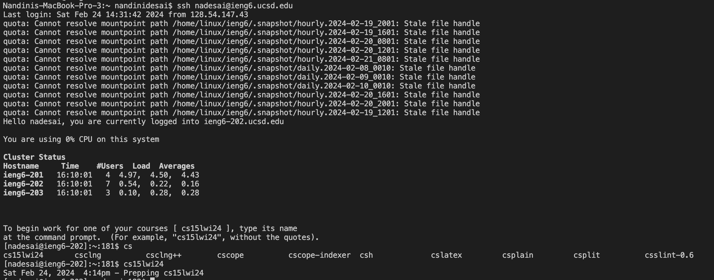

# Lab Report 4 # 

### Step 4 ###

Keys pressed: ```nadesai@ieng6.ucsd.edu``` and ```<enter>```. This command allowed me to log into my private server using ```ieng6```.

### Step 5 ###

Keys pressed: ```git clone```, ```<Command-V>```, and ```<enter>```. The ```git clone git@github.com:nanssssssss/lab7.git``` command was used to clone the forked repository of lab7 on my private server. I used ```<Command-V>``` as a shortcut to copy and paste the GitHub SSH URL. 

### Step 6 ###

Keys pressed: ```cd lab7/``` and ```<enter>```, ```bash test.sh``` and ```<enter>```. This command allowed me to be in the lab 7 directory. I then typed in the ```bash test.sh``` command to run the tests and check for the failures. 

### Step 7 ###

Keys pressed: vim Li, ```<tab>```, .java, then ```<enter>```. ```<up><up><up><up><up><up>```, ```<right><right><right><right><right><right><right><right><right><right><right><right>```, i, ```<delete>```, 2, ```<esc>```, :wq!, ```<enter>```. I used Li then ```<tab>``` as a shortcut to complete the text for ListExamples.java. On the Vim file, I had to go up 6 and 12 right to revise the text in the Java file. I saved my edits with ```:wq!```. 

### Step 8 ###

Keys pressed: ```<up><up>```. The ```bash test.sh``` command was 2 up in the search history, so I just used the up arrow to access it.

### Step 9 ###


Keys pressed: git add ., ```<enter>```, git commit -m "Fixed it", ```<enter>```, git push, ```<enter>```. I used these 3 commands to save my changes to the ListExamples.java file to GitHub. 
