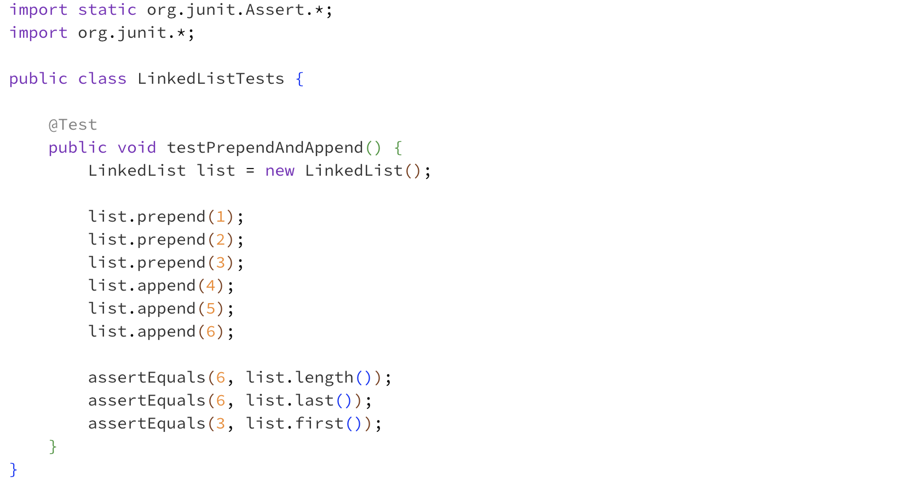
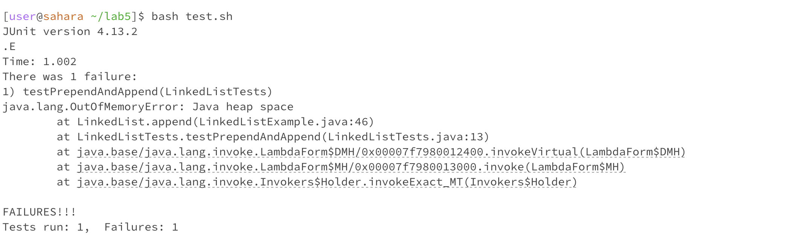
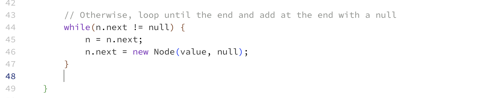
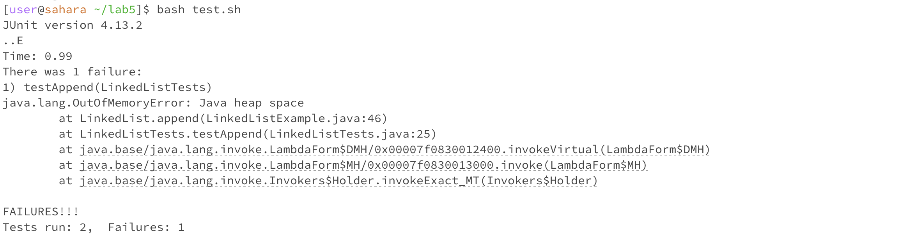
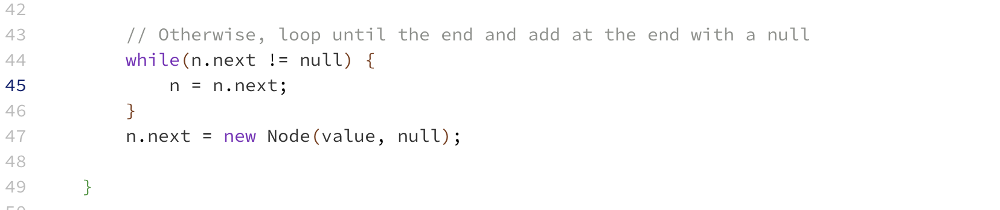

# Lab Report 5 # 

## Part 1 ##
#### Step 1. The original post from a student with a screenshot showing a symptom and a description of a guess at the bug/some sense of what the failure-inducing input is. ####


Hi, I'm trying to run my test script with bash to compile and run my test cases for LinkedList.java, but I'm getting an out-of-memory error when I try to prepend and append items to my list. The error says the issue is at LinkedList.append(LinkedListExample.java:46), so I think the problem is there, but I'm unsure. Please let me know what I should do, thank you!


#### Step 2. A response from a TA asking a leading question or suggesting a command to try. ####
Hi, you should try testing your append() and prepend() methods separately to see which is causing the error. But if your code says the issue is at line 46 in your LinkedListExample.java, I would review your logic for appending an element after the root and your while loop. 

#### Step 3. Another screenshot/terminal output showing what information the student got from trying that, and a clear description of the bug. ####

I tried to test append() and prepend() separately and had it confirmed that the append() method was the issue in my code. I looked over the logic of my append() method and saw that my while loop was checking if n.next was not null, meaning 'n' is not the last node. Then I move to the next node and immediately add a new node after it ('n.next = new Node(value, null'). The process repeats until 'n' reaches the last node. However, with each iteration, I'm not just moving n to the next node, but I'm also adding a new node after it. As a result, I added multiple nodes with the same value after the last node, which is not the intended behavior. I fixed it by adding the new node after I reached the last node in the list, outside of the loop. 

The output now says all tests have passed and the fields are returning the correct values. Thank you!


### All the information needed about the setup including ###
#### The file & directory structure needed #### 
- lab5/ 
  - lib
    - hamcrest-core-1.3.jar
    - junit-4-13.2.jar
  - LinkedList.java
  - LinkedList.class
  - LinkedListTests.java
  - LinkedListTests.class
  - test.sh
#### The contents of each file before fixing the bug ####
test.sh: 
```
CPATH='.:lib/hamcrest-core-1.3.jar:lib/junit-4.13.2.jar'

javac -cp $CPATH LinkedList.java LinkedListTests.java

if [[ $? -ne 0 ]]
then 
    echo "The program failed to compile"
    exit 1
fi

java -cp $CPATH org.junit.runner.JUnitCore LinkedListTests
```
LinkedList.java

```
import java.util.NoSuchElementException;

class Node {
    int value;
    Node next;
    public Node(int value, Node next) {
        this.value = value;
        this.next = next;
    }
}
class LinkedList {
    Node root;
    public LinkedList() {
        this.root = null;
    }
    
    /**
     * Adds the value to the _beginning_ of the list
     * @param value
     */
    public void prepend(int value) {
        // Just add at the beginning
        this.root = new Node(value, this.root);
    }

    /**
     * Adds the value to the _end_ of the list
     * @param value
     */ 
    public void append(int value) {
        if(this.root == null) {
            this.root = new Node(value, null);
            return;
        }
        // If it's just one element, add if after that one
        Node n = this.root;
        if(n.next == null) {
            n.next = new Node(value, null);
            return;
        }
        
        // Otherwise, loop until the end and add at the end with a null
        while(n.next != null) {
            n = n.next;
            n.next = new Node(value, null);
        }
        
    }

    /**
     * @return the value of the first element in the list
     */
    public int first() {
        return this.root.value;
    }
    /**
     * @return the value of the last element in the list
     */
    public int last() {
        Node n = this.root;
        // If no such element, throw an exception
        if(n == null) { throw new NoSuchElementException(); }
        // If it's just one element, return its value
        if(n.next == null) { return n.value; }
        // Otherwise, search for the end of the list and return the last value
        while(n.next != null) {
            n = n.next;
        }
        return n.value;
    }
    /**
     * @return a string representation of the list
     */
    public String toString() {
        Node n = this.root;
        String s = "";
        while(n != null) {
            s += n.value + " ";
            n = n.next;
        }
        return s;
    }
    /**
     * @return the number of elements in the list
     */ 
    public int length() {
        Node n = this.root;
        int i = 0;
        while(n != null) {
            i += 1;
            n = n.next;
        }
        return i;
    }
    
}
```

LinkedListTests.java

```
import static org.junit.Assert.*;
import org.junit.*;

public class LinkedListTests {

    @Test
    public void testPrependAndAppend() {
        LinkedList list = new LinkedList();
        
        list.prepend(1);
        list.prepend(2);
        list.prepend(3);
        list.append(4);
        list.append(5);
        list.append(6);

        assertEquals(6, list.length()); 
        assertEquals(6, list.last());
        assertEquals(3, list.first());
    }
}
```
#### The full command line (or lines) you ran to trigger the bug #### 
[user@sahara ~] cd lab5/
[user@sahara ~/lab5]$ bash test.sh
#### A description of what to edit to fix the bug #### 

LinkedList.java append(): 
```
/**
* Adds the value to the _end_ of the list
* @param value
*/ 
public void append(int value) {
      if(this.root == null) {
          this.root = new Node(value, null);
          return;
      }

      // If it's just one element, add if after that one
      Node n = this.root;
      if(n.next == null) {
          n.next = new Node(value, null);
          return;
      }
        
      // Otherwise, loop until the end and add at the end with a null
      while(n.next != null) {
          n = n.next; // move to next element 
      }

      n.next = new Node(value, null); // add new element at the end 
        
}
```
## Part 2 ##
In the second half of the quarter of this class, I learned about standard output and standard error and how convenient it was to redirect output using the '>'. I also learned a lot about vim and working from the command line. At first, I thought it was super inconvenient, but the more I worked with it, the more I realized that it was actually pretty cool. I also really enjoyed learning how to conveniently save and push information to GitHub using git add, git commit, and git push from the command line. I learned from a classmate how to edit and access different lines of a file through the terminal without setting a breakpoint with jdb. That was pretty cool and helpful for skill demo 4. I also learned how to use ChatGPT for some of my work like debugging or asking questions. I even found myself pressing the up arrow in ChatGPT to simulate getting my most recent input, so there have been a lot of muscle memory things I've learned from this class that I wish were implemented in other software because they're really solid shortcuts.
