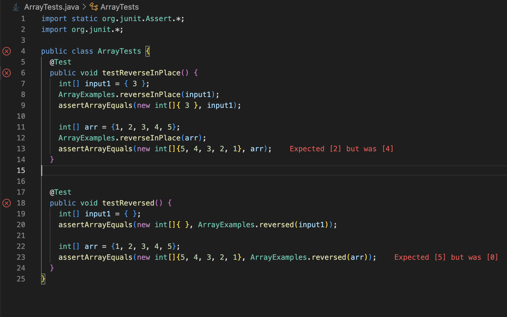

# Lab Report 5 # 

## Part 1 ##
#### Step 1. The original post from a student with a screenshot showing a symptom and a description of a guess at the bug/some sense of what the failure-inducing input is. ####

Hi, I'm trying to run the test script that runs my test cases for LinkedList.java, but I'm getting an out-of-memory error for some reason. It says that this error is occurring in my append method
So, the error might have something to do with adding elements at the end of my LinkedList.
